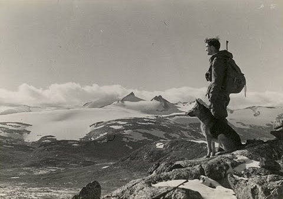

The work represented here is an attempt to establish and develop a set of philosophical principles and to do so collaboratively by employing appropriate technologies for ease of iteration and publication.  Here, we will survey variations of what we refer to as the *expeditionary mode* and more specifically will we explore and employ what might best be referred to as the mode of [rapid expedition](rapidExpedition).

The goal is to pioneer a comprehensive philosophical mode by which to not only assess what is most worthy and worthwhile, but to engage with whatever might come of that in a fashion equally worthy.  As this work will remain [open-source](https://en.wikipedia.org/wiki/Open-source_model), its development will be public, and its contents available for copy and alteration.
